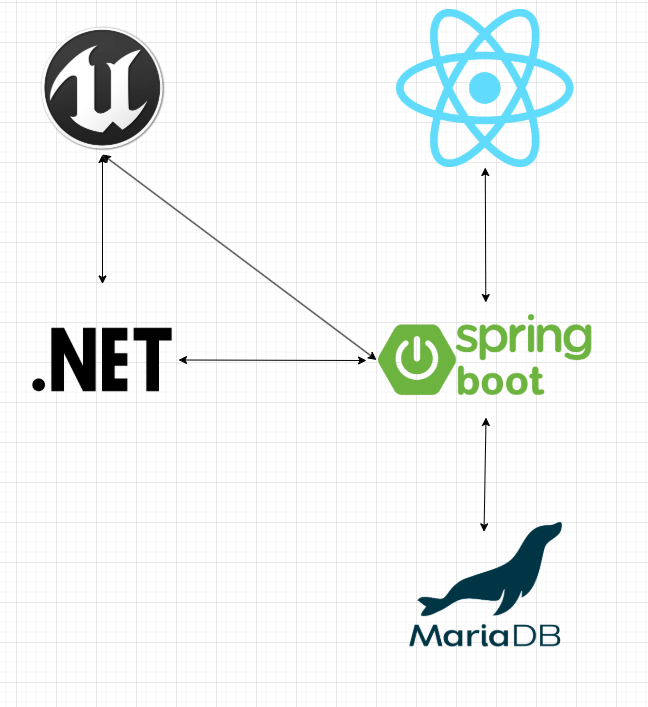
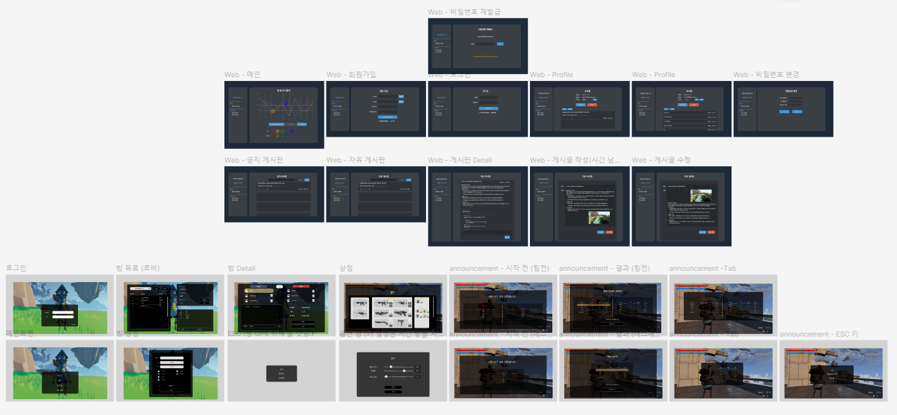

# B1(멀티 슈팅 게임 - [github](https://github.com/Blaster-Games/B1)) 커뮤니티/통계 사이트

## 목차
  - [서비스 개요](#서비스-개요)
  - [팀원 소개](#팀원-소개)
  - [기술 스택](#기술-스택)
  - [시스템 아키텍처](#시스템-아키텍처)
  - [기능 소개](#기능-소개)
    

## 서비스 개요

```
훌륭한 인디게임이라도 홍보할 기회가 부족해 주목받지 못하고 사라지는 경우가 많습니다.
이러한 문제를 해결하기 위해 인디게임 개발자와 플레이어를 직접 연결해주는 플랫폼을 만들었습니다.


기간: 2024.10 ~ 2024.11 (5주)
```

## 팀원 소개

|  |  |  |
|:------------------------------------------------------------------------------------------------------:|:--------------------------------------------------------------------------------------------------:|:------------------------------------------------------------------------------------------------------:|
| [곽효선<br/>(Game Server)](https://github.com/hyoseon1201)                                                | [전근렬<br/>(Game Client)](https://github.com/CHAFALL)                                                | [김동영<br/>(Web)](https://github.com/K-Dongyoung)                                                        |

## 기술 스택


```
Back-end : Spring boot 3.3.5, java 17
Front-end : Node.js 20 LTS, React 18.3.1
Game-Server : .Net 8.0
Game-Client : Unreal Engine 5.4 
```

## 시스템 아키텍처



## 기능 소개

#### 웹

##### 메인페이지

|  |
|:-------------------------------------------:|
| 메인페이지                                       |

##### 게시글

|    |
|:-------------------------------------------:|
| 게시글 위                                       |
|  |
| 게시글 아래                                      |
|  |
| 게시글 작성                                      |
|  |
| 게시글 상세                                      |

##### 통계

|  |
|:---------------------------------------------------------:|
| 일일 게임 이용 시간 (유저)                                          |
|  |
| 일일 게임 접속자 수(전체)                                           |
|                  |
| 맵 별 통계 (FPS 특화 통계)                                        |

#### 게임

##### 로비 / 방 (TCP 서버 이용)

|  |  |
|:---------------------------------------:|:---------------------------------------:|
| 방 생성                                    | 방 내부 (채팅 기능 포함)                         |

##### 인게임 내 UI

|      |
|:---------------------------------------:|
| Tab 키                                   |
|        |
| 상점 (매 라운드 사이)                           |
|  |
| 결과 창                                    |

###### 

###### 인게임 내 상세 동작은 아래 링크를 확인해주세요.

[인게임 내 상세 동작](https://github.com/CHAFALL/Blaster)

### 게임 시연 영상

|  |
|:------------------------------------------------------------------------:|
| 시연 영상 (1분 25초)                                                           |

### 프로젝트 산출물

##### ERD


##### 와이어프레임



https://www.figma.com/design/aLG09eCO3Mz2DcafxBr0yE/Blaster?node-id=0-1&p=f&t=YoF8Je5eyPRvfqci-0
