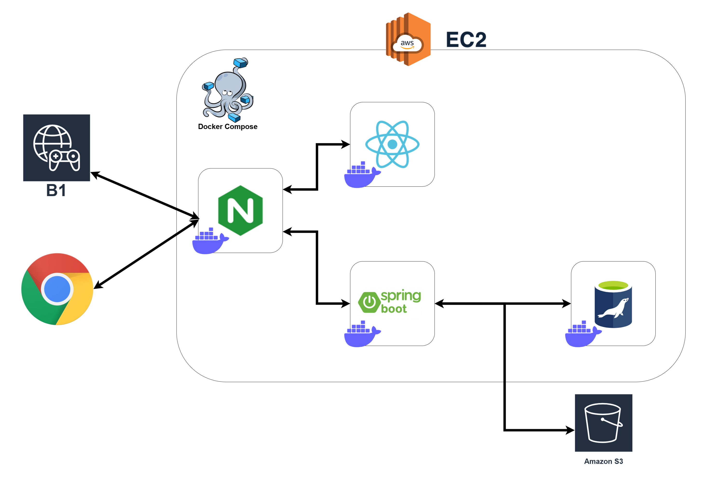
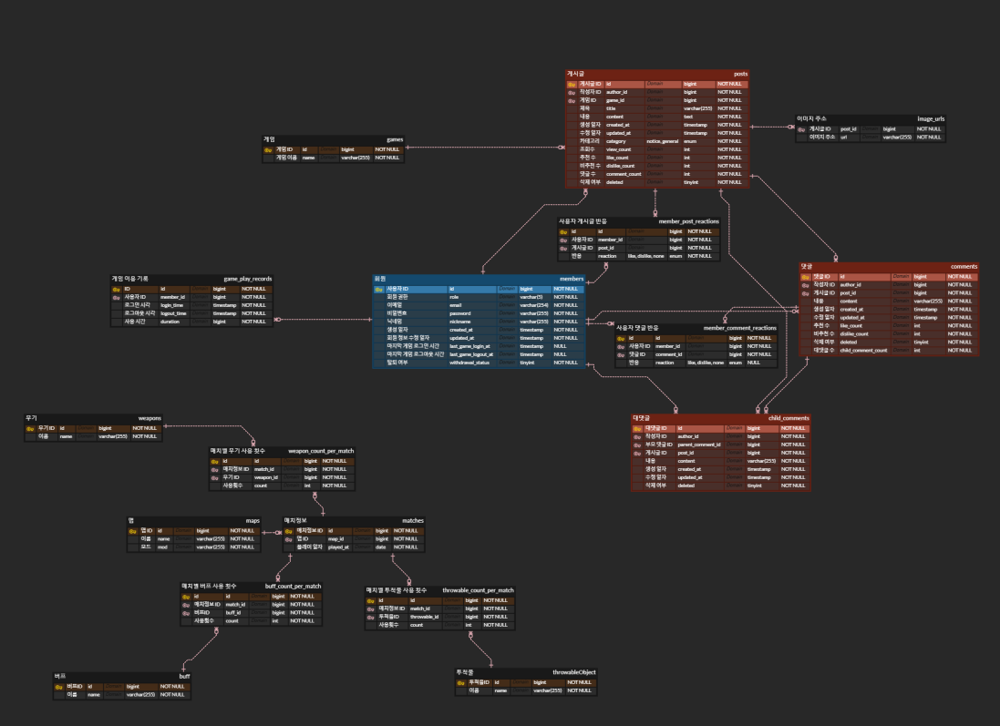

# B1 Web

## 목차
  - [서비스 개요](#서비스-개요)
  - [주요 기능](#주요-기능)
  - [기술 스택](#기술-스택)
  - [시스템 아키텍처](#시스템-아키텍처)
  - [미구현 기능 및 개선 예정 사항](#미구현-기능-및-개선-예정-사항)

## 서비스 개요

```
멀티 슈팅 게임 B1의 홈페이지입니다.
게임 개발자와 플레이어를 연결해주는 플랫폼입니다.
게임 관련 통계 또한 제공합니다.

기간: 2024.10 ~ 2024.11 (5주)
```
- 배포 주소: [http://3.34.134.226/blaster](http://3.34.134.226/blaster)
- B1 github: [https://github.com/Blaster-Games/B1](https://github.com/Blaster-Games/B1)

## 주요 기능
- 회원가입 및 로그인(jwt, spring security)
- 게시글 CRUD(Quill, S3)
- 게임 통계(Chart.js)

##### 게시글

|    |
|:-------------------------------------------:|
| 게시글 위                                       |
|  |
| 게시글 아래                                      |
|  |
| 게시글 작성                                      |
|  |
| 게시글 상세                                      |

##### 통계

|  |
|:---------------------------------------------------------:|
| 일일 게임 이용 시간 (유저)                                          |
|  |
| 일일 게임 접속자 수(전체)                                           |
|                  |
| 맵 별 통계 (FPS 특화 통계)                                        |

## 기술 스택

```
Back-end : Spring boot 3.3.5, java 17
Front-end : Node.js 20 LTS, React 18.3.1
Database : MariaDB
Infra : AWS EC2, Docker, Docker Compose, Nginx
```

## 시스템 아키텍처



### 프로젝트 산출물

##### ERD



## 미구현 기능 및 개선 예정 사항
- 회원 탈퇴
- 나의 게시글, 댓글, 추천한 댓글 조회
- 통계 조회, 게시글 조회 시 성능 개선
- https 적용
- CI/CD 도입


[⬆️ 맨 위로](#B1-Web)
